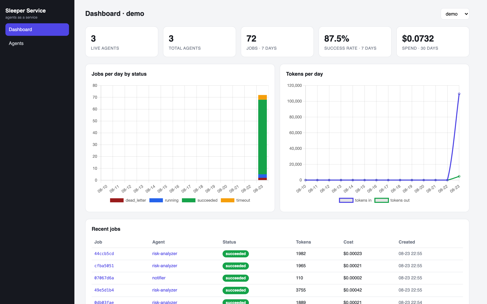
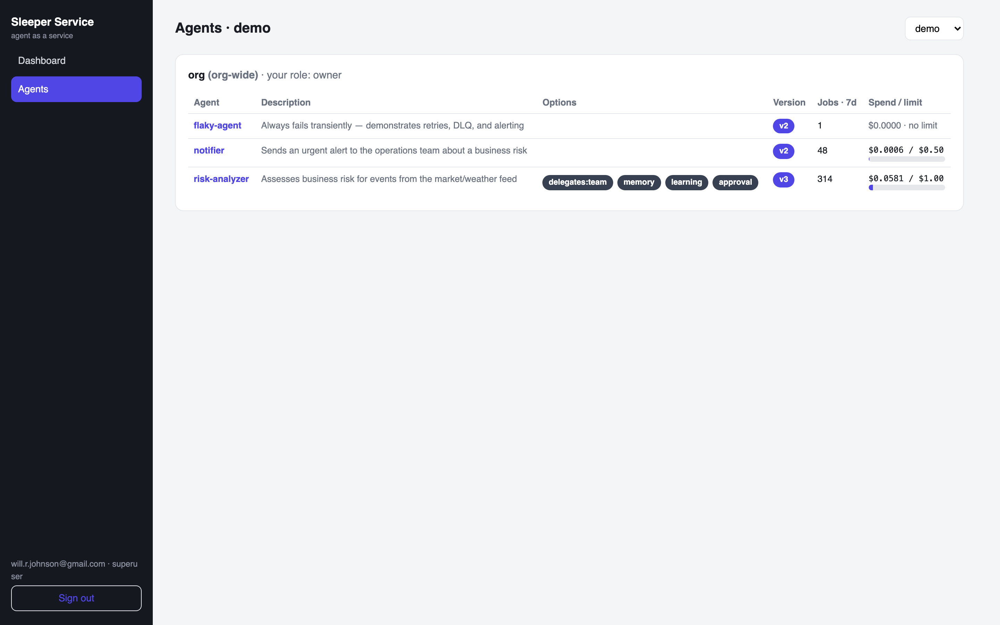
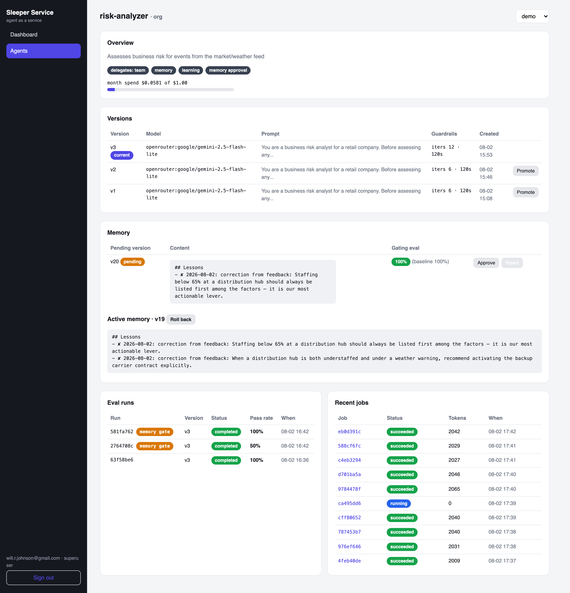
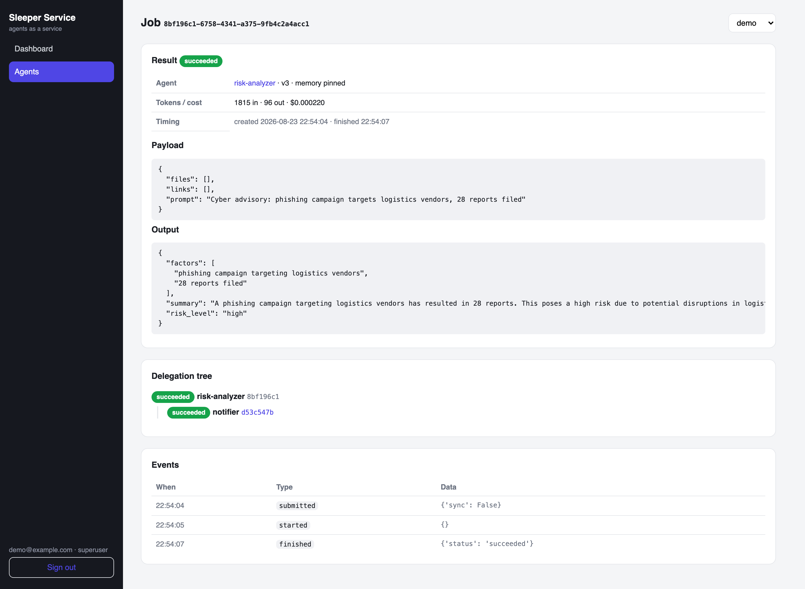
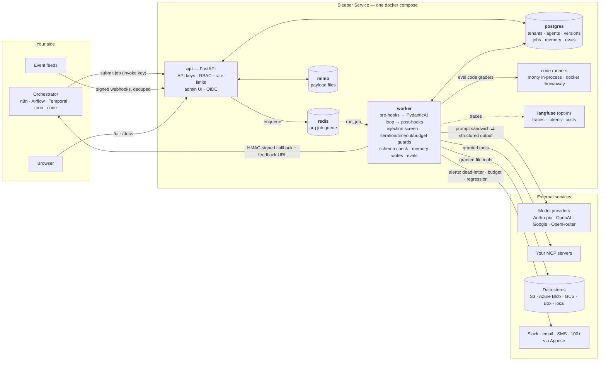
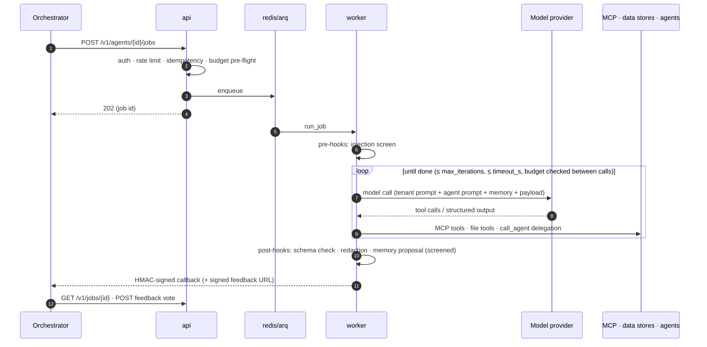

# Sleeper Service

**Agent as a Service.** One agent. One task. A thousand of them.

Sleeper Service is an open-source, self-hosted platform for running fleets of narrow, single-purpose AI agents as API endpoints. Instead of one autonomous agent trying to do everything, you define many small agents that each do one job well — repeatedly, auditably, and inside your existing orchestrated workflows.

Every agent is a function: it takes an input, does analysis (optionally using tools), and returns output in a shape you define. Your orchestrator (n8n, Airflow, Temporal, cron, plain code) treats it like any other workflow node.

## Why

- **Repeatable, not autonomous.** Agents are built for processes that run over and over, where AI makes one decision or takes one action per invocation.
- **Auditable by construction.** Every edit to an agent's prompt, model, parameters, tools, or output schema creates a new immutable version. Every job records exactly which agent version (and memory version) ran.
- **Owned by humans.** Every agent belongs to a team, every team has an owner, and the risky switches — learning, memory, delegation — are owner-gated.
- **Pluggable inference.** Anthropic, OpenAI, Google, OpenRouter — swap per agent, track tokens and cost per job, rolled up per agent.
- **Composable.** Agents discover and delegate to each other (permission-gated, depth-capped, cycle-checked, fully traced as a job tree).

## Core concepts

| Concept | What it is |
|---|---|
| **Tenant** | Top-level org. Holds the base system prompt every agent inherits. Multi-tenant out of the box. |
| **Team** | Owns agents. Users join teams as owner / editor / viewer; every team keeps at least one owner. |
| **Agent** | A named, single-purpose worker: prompt + model + tool and data store grants + output schema + options (delegation, memory, learning, spending limit). |
| **Version** | Immutable snapshot of an agent's configuration. Jobs pin any version or alias (`dev`/`staging`/`prod`); promotion/rollback just repoints `current` or the alias. |
| **Job** | One invocation of one agent version. Async by default with HMAC-signed webhook callbacks; `?sync=true` for fast calls. Full event audit trail per job. |
| **Data store** | A registered storage backend (S3/MinIO, Azure Blob, GCS, Box, local) an agent is granted access to — path-prefix-scoped, read-only by default. Box grants pin a folder ID: credentials are downscoped to that subtree and paths resolve by name from it, so nothing outside is addressable. |
| **Event source** | Webhook ingress that turns external events into jobs, with per-source secrets and dedup. Scheduling and polling stay in your orchestrator — Sleeper Service just receives. |
| **Hooks** | Pre-hooks (prompt-injection screening, default on) and post-hooks (output schema validation, opt-in PII redaction) around every job. |
| **Memory / Learning** | Opt-in per-agent memory document, versioned like everything else, steerable by signed per-job feedback votes. Optionally gated: owners approve every memory change, informed by an automatic eval run. |
| **Eval suite** | Saved inputs + deterministic field checks per agent. Runs grade any version — branch comparison, promotion decisions, and the gate on memory edits. |

## What's in the box

**API & auth** — FastAPI with OpenAPI docs at `/docs`. Two kinds of API keys, hashed at rest: *user keys* (act as a user, inherit team RBAC — the management plane) and *invoke keys* (tenant/team/agent-scoped, can only submit jobs, read results, post feedback — the data plane for orchestrators). Per-key rate limiting. RBAC enforced at the API: 404 for what you can't see, 403 for what you can't do.

**Execution** — PydanticAI runtime: prompt sandwich (tenant system prompt → agent prompt → memory), structured output enforced from the stored JSON Schema, per-version model params. Runtime guardrails: `max_iterations` (request cap) and `timeout_s` (wall clock) with first-class `iteration_limit` / `timeout` statuses. Redis + arq workers with transient-error retries, exponential backoff, and dead-lettering; idempotency keys dedupe submissions.

**Tools & data** — MCP server registry (streamable HTTP / SSE / stdio) with per-version tool grants filtered to named tools; `user_ctx` passthrough as a header. Data-store file tools (list/read/write via fsspec) scoped to a granted path prefix. Payload file uploads to MinIO. External links fetched only through a per-tenant domain allowlist, always delimited as untrusted.

**Safety & spend** — Prompt-injection screening over all untrusted content (payload, files, links) with `rejected` status and audit events: on by default, tenant-tunable (add custom patterns, suppress a built-in rule that false-positives on your domain), disable-able per tenant or agent; memory writes and feedback comments pass the same screen (poisoning defense). An opt-in second tier (`hooks.injection_classifier_model`) asks a cheap model for a structured verdict on anything the heuristics pass — fail-open, hard-timeboxed, and not billed to job spend. Monthly spending limits per agent: pre-flight refusal with auditable `budget_exceeded` rows; per-job token/cost accounting via genai-prices. Provider credentials encrypted at rest (Fernet).

**Events & alerting** — Webhook event sources with `{{path}}` payload templates and `dedup_key_path` dedup. Apprise notification channels per team (Slack/email/SMS/100+ services) subscribed to `dead_letter`, `budget`, `eval_regression` — deduplicated per agent per window.

**Delegation** — Built-in `list_agents` (the rolodex: names, descriptions, I/O schemas) and `call_agent` tools, gated per agent (none/team/tenant). Child jobs carry `parent_job_id`; `GET /v1/jobs/{id}/tree` returns the audited tree. Depth caps and cycle detection.

**Memory & learning** — Opt-in memory document injected after the agent prompt; the agent proposes edits via an `update_memory` tool, applied post-run (screened, size-capped). Learning adds signed single-job feedback URLs; votes fold deterministically into memory (a − comment becomes a corrective rule) — or, opt-in per tenant, an LLM fold distills feedback into generalizable lessons and condenses over-cap memory instead of dropping oldest-first, always falling back to the deterministic path. Governance: enabling any of this requires the team owner, and `memory_approval` mode queues every memory change for owner approval — with the gating eval run's pass rate shown alongside — plus one-click rollback.

**Evals** — Cases are saved inputs + checks (`equals`, `contains`, `in_range`, `matches_regex`, `is_valid`); grading is deterministic and free. For logic beyond assertions, a `code` check runs an editor-supplied `grade(output)` function in a hard-capped sandbox — in-process [Pydantic Monty](https://github.com/pydantic/monty) by default (wall-clock/memory/recursion limits, no imports, filesystem, or network), or a hardened throwaway Docker container per call (real CPython with packages, no network, capabilities dropped) where the operator has enabled the `docker` runner backend. Runs execute through the normal pipeline (hooks and tracing apply) against any version, excluded from production spend. Pending memory versions auto-trigger a gated run; regressions alert the team.

**Admin UI** — Ships in the api container (server-rendered, no node toolchain): per-tenant dashboard with live-agent count, success rate, spend, and jobs/tokens charts; teams → agents with option badges and budget meters; version promotion and rollback; the memory approval queue with gating-eval pass rates against baseline; eval run history; job detail with payload, output, audit events, the delegation tree, and one-click dead-letter retry. Session login with the same users and RBAC as the API; optional per-tenant OIDC SSO (Keycloak/Authentik/any discovery-speaking IdP) sits alongside — configure it at `PUT /v1/tenants/{id}/oidc` and a "Continue with … SSO" button appears on the login page. Local auth always keeps working, and SSO users must already exist (no just-in-time provisioning).

**Observability** — Langfuse (self-hosted, opt-in compose profile) ingests every agent run via OTLP — prompts, responses, tokens, tool calls. The seam is plain OpenTelemetry, so any OTLP backend works.

**Ops** — Everything ships as Docker Compose (api, worker, Postgres, Redis, MinIO; `--profile langfuse`, `--profile demo`). Alembic migrations; CI via GitHub Actions. Hourly retention: per-tenant file TTLs and job payload retention (rows and spend stats survive). Per-tenant worker concurrency caps. Deep health checks for api and worker. `sleeper` CLI: `init` (bootstrap; refuses placeholder secrets), `seed-models`, `demo-setup`. A `test` provider runs the entire pipeline without vendor keys (and `test/flaky` exercises retry/DLQ/alerting paths).

## The admin UI

| | |
|---|---|
|  |  |
| *Per-tenant dashboard: live agents, success rate, spend, jobs & tokens* | *Teams → agents with option badges and budget meters* |
|  |  |
| *Versions with promote, memory approval queue with gating-eval scores* | *Job detail: typed output, audit events, delegation tree* |

## Architecture

Everything ships as one Docker Compose stack. Your orchestrator and event feeds talk to the API; workers do the thinking; everything the platform learns or decides lands in Postgres, versioned.



Data flows worth noting:

- **Two planes, two key kinds.** Orchestrators hold *invoke keys* (submit/read/feedback only); humans and management tooling use *user keys* or sessions. Event feeds hold only per-source webhook secrets — never platform keys.
- **Nothing untrusted touches a prompt unscreened.** Payloads, fetched links, feedback comments, and memory writes all pass the same injection screen before the model sees them or anything persists.
- **Every write that changes behavior is a version.** Agent configs, memory documents, and promotions are immutable rows in Postgres; a job records exactly which of each it ran with.
- **Results push, don't poll.** Workers deliver HMAC-signed callbacks with retries; exhausted retries dead-letter the job and page the owning team via Apprise.

### A job's life



Python / FastAPI, PydanticAI agent runtime, Postgres, Redis + arq workers, MCP for tool access, fsspec for data stores, pluggable sandboxed code runners, Langfuse for tracing.

## Quickstart

```bash
git clone https://github.com/willjohnson/sleeper-service.git && cd sleeper-service
cp .env.example .env        # set SECRET_KEY and a provider API key
docker compose up -d
docker compose exec api sleeper init          # first tenant, team, superuser → prints your API key
docker compose exec api sleeper seed-models   # register starter models (incl. keyless test provider)
```

Create an agent, give it a version, run a job:

```bash
# The agent is the stable identity...
curl -X POST localhost:8000/v1/agents \
  -H "Authorization: Bearer $SLEEPER_KEY" \
  -d '{"team_id": "…", "name": "risk-analyzer", "description": "Assesses business risk"}'

# ...its configuration lives in immutable versions (first one auto-promotes)
curl -X POST localhost:8000/v1/agents/$AGENT_ID/versions \
  -H "Authorization: Bearer $SLEEPER_KEY" \
  -d '{
    "model": "anthropic/claude-sonnet-5",
    "prompt": "Assess business risk for the event in the payload.",
    "output_schema": {
      "type": "object",
      "properties": {
        "risk_level": {"enum": ["low", "medium", "high"]},
        "factors": {"type": "array", "items": {"type": "string"}},
        "summary": {"type": "string"}
      }
    }
  }'

# Submit a job (async — result arrives at your callback, HMAC-signed)
curl -X POST localhost:8000/v1/agents/$AGENT_ID/jobs \
  -H "Authorization: Bearer $SLEEPER_KEY" \
  -d '{
    "context": {"prompt": "AAPL dropped 6% in 20 minutes; storm warnings in STL"},
    "callback_url": "https://yourapp.com/hooks/risk"
  }'
# → 202 { "id": … }         also pollable at GET /v1/jobs/{id}
```

## Demo: risk analysis on an event feed

```bash
docker compose exec api sleeper demo-setup    # demo tenant, agents, event sources, reference data, alerts
docker compose --profile demo up -d           # external poller + alert sink
docker compose logs -f demo-poller
```

A poller script (playing the role of *your* orchestrator — it holds only webhook secrets, no platform key) posts synthetic market/weather events. The `risk-analyzer` reads a risk playbook from a granted S3 data store, and on high risk discovers and **delegates** to a `notifier` agent — auditable as a job tree. Along the way: duplicate events are deduped, an injected prompt is caught and logged, and a deliberately flaky agent retries, dead-letters, and pages the demo alert channel. Add `--profile langfuse` for traces at `localhost:3000`.

Other things people build with this pattern: accounts-receivable agents matching deposits to invoices, customer-service agents answering tickets, classification and enrichment steps inside data pipelines.

## Roadmap

- [x] Core: tenants, teams, agents, versioning, jobs, callbacks *(Phases 0–1)*
- [x] Hooks, spending limits, MCP tool grants, data stores, event sources, alerting *(Phase 2)*
- [x] Delegation, memory, feedback-driven learning *(Phase 3)*
- [x] Eval harness + memory approval governance *(Phase 4)*
- [x] Admin UI: dashboard, promotion, memory approvals, job trees *(Phase 4)*
- [x] OIDC login, version aliases, sandboxed code runners (in-process + docker) *(Phase 4)*
- [x] Opt-in LLM tiers: injection classifier, memory fold & compaction
- [ ] Hosted sandbox backends (E2B / Modal) — drop-in registry extension, if ever needed

See [docs/BUILD_PLAN.md](docs/BUILD_PLAN.md) for the full plan, data model, and decision log.

## The name

The *Sleeper Service* is a General Systems Vehicle from Iain M. Banks' *Excession* — an eccentric ship that spent decades quietly building and maintaining a fleet of eighty thousand autonomous units, ready the moment they were needed. That's the idea here: not one agent doing everything, but a service that keeps a fleet of narrow, reliable agents on station.

## License

Apache-2.0
