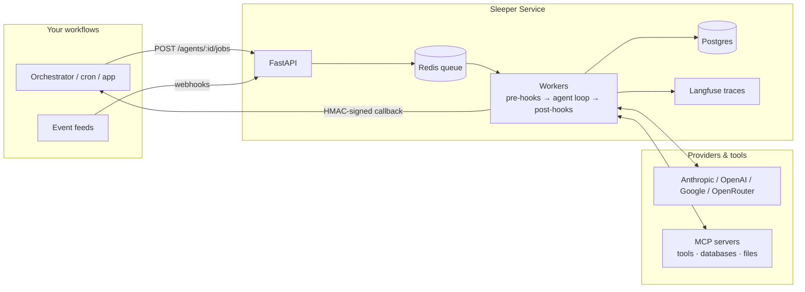

# Sleeper Service

**Agent as a Service.** One agent. One task. A thousand of them.

Sleeper Service is an open-source, self-hosted platform for running fleets of narrow, single-purpose AI agents as API endpoints. Instead of one autonomous agent trying to do everything, you define many small agents that each do one job well — repeatedly, auditably, and inside your existing orchestrated workflows.

Every agent is a function: it takes an input, does analysis (optionally using tools), and returns output in a shape you define — a boolean, a paragraph, a JSON object, a file. Your orchestrator (n8n, Airflow, Temporal, cron, plain code) treats it like any other workflow node.

## Why

- **Repeatable, not autonomous.** Agents are built for processes that run over and over, where AI makes one decision or takes one action per invocation.
- **Auditable by construction.** Every edit to an agent's prompt, model, parameters, tools, or output schema creates a new immutable version. Every job records exactly which version ran.
- **Owned by humans.** Every agent belongs to a team, and every team has an owner — a responsible party for every agent in production.
- **Pluggable inference.** Anthropic, OpenAI, Google, OpenRouter — swap per agent, track cost per agent/team/tenant.
- **Composable.** Agents can delegate to other agents (permission-gated, budget-capped, fully traced as a job tree).

## Core concepts

| Concept | What it is |
|---|---|
| **Tenant** | Top-level org. Holds the base system prompt every agent inherits. Multi-tenant out of the box. |
| **Team** | Owns agents. Users join teams with roles; every team has at least one owner. |
| **Agent** | A named, single-purpose worker: prompt + model + tool and data store grants + output schema + options (memory, learning, delegation permissions, spending limit). |
| **Version** | Immutable snapshot of an agent's configuration. Branch an agent to experiment; compare branches with evals. |
| **Job** | One invocation of one agent version. Async by default with signed webhook callbacks; sync for fast calls. |
| **Data store** | A registered storage backend (S3, Azure Blob, GCS, Box, local) an agent is granted access to — persistent file access with path scoping, instead of passing files in every payload. |
| **Event source** | Webhook ingress that turns external events (a price tick, a weather alert, a new ticket) into jobs. Scheduling and polling stay in your orchestrator — Sleeper Service just receives. |
| **Hooks** | Pre-hooks (prompt-injection screening) and post-hooks (output schema validation, PII redaction, formatters) around every job. |
| **Memory / Learning** | Opt-in per-agent memory document, steerable by client feedback votes on job results. |

## Architecture



Python / FastAPI, PydanticAI agent runtime, Postgres, Redis + arq workers, MCP for tool and database access, Langfuse for prompt/response/token logging. Everything ships as Docker Compose.

## Quickstart

```bash
git clone <repo> && cd sleeper-service
cp .env.example .env        # set SECRET_KEY and a provider API key
docker compose up -d
```

Create an agent and run a job:

```bash
# Create an agent with a typed output shape
curl -X POST localhost:8000/v1/agents \
  -H "Authorization: Bearer $SLEEPER_KEY" \
  -d '{
    "name": "risk-analyzer",
    "team_id": "…",
    "model": "anthropic/claude-sonnet-5",
    "prompt": "Assess business risk for the event in the payload.",
    "output_schema": {
      "type": "object",
      "properties": {
        "risk_level": {"enum": ["low", "medium", "high"]},
        "factors": {"type": "array", "items": {"type": "string"}},
        "summary": {"type": "string"}
      }
    }
  }'

# Submit a job (async — result arrives at your callback, HMAC-signed)
curl -X POST localhost:8000/v1/agents/$AGENT_ID/jobs \
  -H "Authorization: Bearer $SLEEPER_KEY" \
  -d '{
    "context": {"prompt": "AAPL dropped 6% in 20 minutes; storm warnings in STL"},
    "callback_url": "https://yourapp.com/hooks/risk"
  }'
# → { "job_id": "…" }        also pollable at GET /v1/jobs/{job_id}
```

## Example: risk analysis on an event feed

The repo ships with a working demo: a small external poller script (playing the role of your orchestrator) watches stock prices and weather and posts events to a webhook event source, which runs a `risk-analyzer` agent; when `risk_level` crosses a threshold the analyzer **delegates** to a `notifier` agent. One example exercises event sources, structured outputs, spending limits, and agent-to-agent delegation — and the whole run is auditable as a job tree against exact agent versions.

Other things people build with this pattern: accounts-receivable agents matching deposits to invoices, customer-service agents answering tickets, classification and enrichment steps inside data pipelines.

## Roadmap

- [x] Core: tenants, teams, agents, versioning, jobs, callbacks *(Phases 0–1)*
- [ ] Hooks, spending limits, MCP tool grants, event sources *(Phase 2)*
- [ ] Delegation, memory, feedback-driven learning *(Phase 3)*
- [ ] Eval harness, admin UI (agent org chart, usage stats), sandboxed code runners *(Phase 4)*

See [BUILD_PLAN.md](BUILD_PLAN.md) for the full plan, data model, and open questions.

## The name

The *Sleeper Service* is a General Systems Vehicle from Iain M. Banks' *Excession* — an eccentric ship that spent decades quietly building and maintaining a fleet of eighty thousand autonomous units, ready the moment they were needed. That's the idea here: not one agent doing everything, but a service that keeps a fleet of narrow, reliable agents on station.

## License

Apache-2.0
